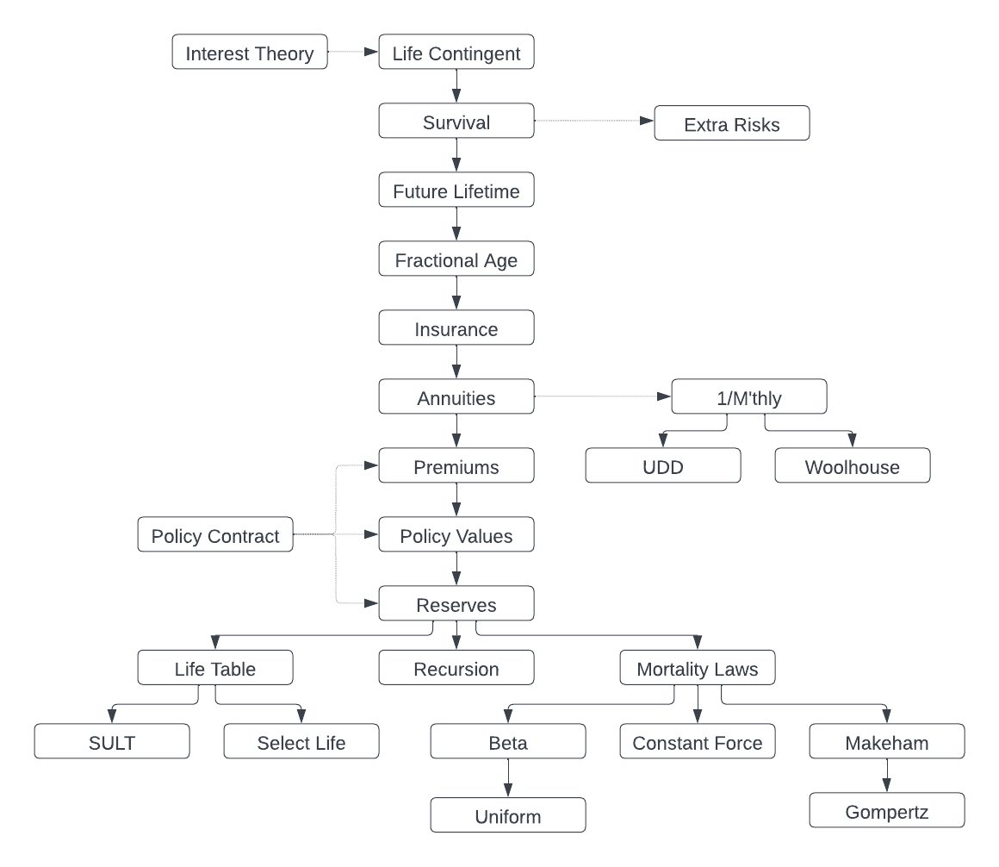

# Actuarial Math

## Actuarial Math - Life Contingent Risks

This `actuarialmath` package implements in Python the general
formulas, recursive relationships and shortcut equations for
Fundamentals of Long Term Actuarial Mathematics, to solve the SOA
sample FAM-L questions and more.

- The concepts are developed hierarchically in [object-oriented Python](https://github.com/terence-lim/actuarialmath.git).

- Each module incrementally introduces the [formulas used, with usage examples](https://terence-lim.github.io/notes/actuarialmath.pdf).

- The SOA sample questions (released in August 2022) are solved in an
[executable Google Colab Notebook](https://colab.research.google.com/drive/1qguTCMQSk0m273IHApXA7IpUJwSoKEb-?usp=sharing).

Enjoy!

Terence Lim

MIT License. Copyright 2022, Terence Lim

## Concepts and Classes



## Usage Examples

- SOA sample question 6.4: Calculate premium using normal
  approximation for monthly whole life annuities-due.

```
mthly = Mthly(m=12, life=Reserves(interest=dict(i=0.06)))
A1, A2 = 0.4075, 0.2105
mean = mthly.annuity_twin(A1)*15*12
var = mthly.annuity_variance(A1=A1, A2=A2, b=15 * 12)
S = Reserves.portfolio_percentile(mean=mean, variance=var, prob=.9, N=200)
```

- SOA sample question 6.40: Calculate annual net premium for a special
  fully discrete whole life insurance at issue age $x+1$

```
life = Recursion(interest=dict(i=0.06)).set_a(7, x=x+1).set_q(0.05, x=x)
a = life.whole_life_annuity(x)
A = 110 * a / 1000
life = Recursion(interest=dict(i=0.06)).set_A(A, x=x).set_q(0.05, x=x)
A1 = life.whole_life_insurance(x+1)
P = life.gross_premium(A=A1 / 1.03, a=7) * 1000
```

- SOA sample question 7.20: Calculate gross premium policy value and
  modified reserves where mortality follows the Standard Ultimate Life
  Table.

```
life = SULT()
S = life.FPT_policy_value(35, t=1, b=1000)  # is 0 for FPT at t=0,1
policy = life.Policy(benefit=1000, initial_premium=.3, initial_policy=300,
                     renewal_premium=.04, renewal_policy=30)
P = life.gross_premium(A=life.whole_life_insurance(35), **policy.premium_terms)
R = life.gross_policy_value(35, t=1, policy=policy.set(premium=P))
```

## Resources

- Documentation and formulas: [actuarialmath.pdf](https://terence-lim.github.io/notes/actuarialmath.pdf)

- Executable Colab Notebook: [faml.ipynb](https://colab.research.google.com/drive/1qguTCMQSk0m273IHApXA7IpUJwSoKEb-?usp=sharing)

- Github repo: [https://github.com/terence-lim/actuarialmath.git](https://github.com/terence-lim/actuarialmath.git)

- SOA FAM-L Sample Solutions: [copy retrieved Aug 2022](https://terence-lim.github.io/notes/2022-10-exam-fam-l-sol.pdf)

- SOA FAM-L Sample Questions: [copy retrieved Aug 2022](https://terence-lim.github.io/notes/2022-10-exam-fam-l-quest.pdf)

- Actuarial Mathematics for Life Contingent Risks (Dickson, Hardy and Waters), Institute and Faculty of Actuaries, published by Cambridge University Press

## Contact me

Linkedin: [https://www.linkedin.com/in/terencelim](https://www.linkedin.com/in/terencelim)

Github: [https://terence-lim.github.io](https://terence-lim.github.io)


